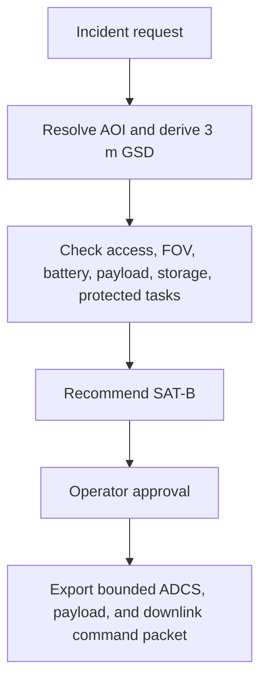
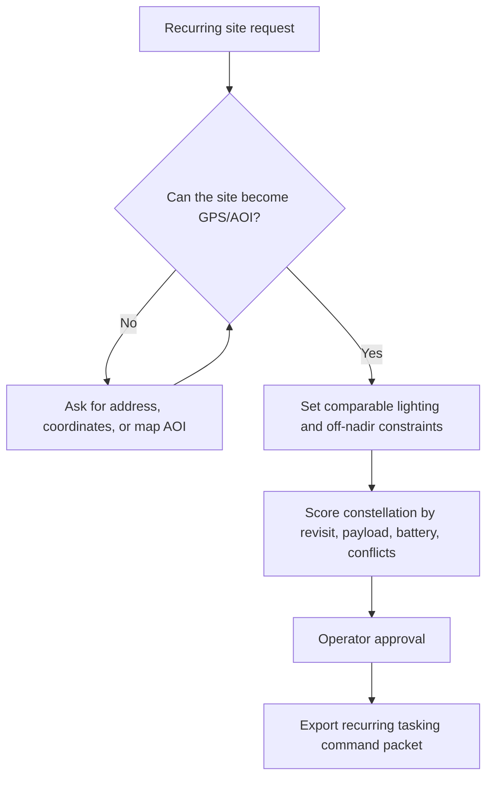

# Expert Review Iterations / 專家五輪迭代紀錄

This note records the five-round review used to improve the INNOspace demo UI.

## Round 1: UX Expert / 使用者體驗專家

Finding: Judges need to know where they are in the mission workflow without reading every panel.

Change: Added a five-step operator progress strip: Request, Clarify, Plan, Approve, Export.

## Round 2: Business Model Expert / 商業模式專家

Finding: The product value needs to be visible beside the technical workflow.

Change: Added buyer, value promise, and proof metrics for each scenario.

## Round 3: Satellite Operations Engineer / 衛星操作工程師

Finding: The demo must make command safety credible.

Change: Kept satellite command packets behind operator approval and emphasized feasibility checks before ADCS, payload, and downlink commands are released.

## Round 4: Scenario Walkthrough / 情境走查

Finding: Each scenario needs a visible journey from natural language to command packet.

Change: Added scenario flow diagrams for wildfire response and construction monitoring.

## Round 5: Demo Resilience / 展示穩定性

Finding: The Mission Area view should work without paid map APIs.

Change: Kept preset imagery and uploads, and added a free OpenStreetMap option.

## Wildfire Response Flow / 森林大火情境流程

## Construction Monitoring Flow / 工地監測情境流程

