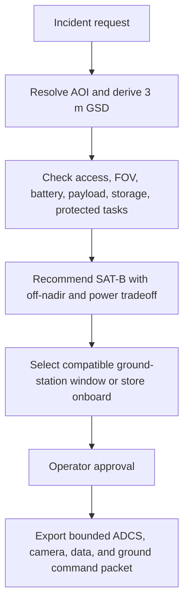
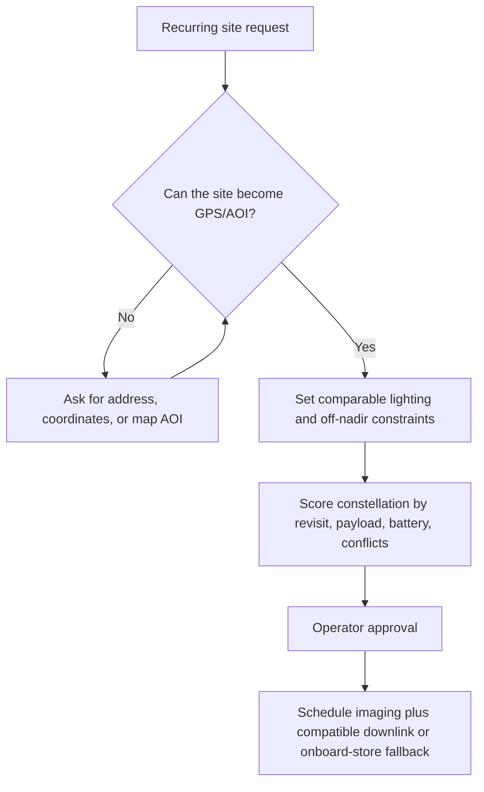

# Expert Review Iterations / 專家五輪迭代紀錄

This note records the five-round review used to improve the INNOspace demo UI.

## Round 1: UX Expert / 使用者體驗專家

Finding: Judges need to know where they are in the mission workflow without reading every panel.

Change: Added a five-step operator progress strip: Request, Clarify, Plan, Approve, Export.

## Round 2: Business Model Expert / 商業模式專家

Finding: The product value needs to be visible beside the technical workflow.

Change: Added buyer, value promise, and proof metrics for each scenario.

## Round 3: Satellite Operations Engineer / 衛星操作工程師

Finding: The demo must make command safety credible.

Change: Kept satellite command packets behind operator approval and emphasized feasibility checks before ADCS, payload, and downlink commands are released.

2026-05-20 update: Step 08 now separates ADCS, camera, data storage, and ground-station downlink commands. Imaging no longer assumes immediate downlink; the plan must select a compatible ground station or keep the product onboard.

## Round 4: Scenario Walkthrough / 情境走查

Finding: Each scenario needs a visible journey from natural language to command packet.

Change: Added scenario flow diagrams for wildfire response and construction monitoring.

2026-05-20 update: The first-step Next action now starts the same LLM interpretation path as Analyze Request. During analysis, the UI shows staged progress for semantic parsing, AOI/geocode, mission boundary checks, feasibility scoring, and command generation.

## Round 5: Demo Resilience / 展示穩定性

Finding: The Mission Area view should work without paid map APIs.

Change: Kept preset imagery and uploads, and added a free OpenStreetMap option.

2026-05-20 update: The UI prioritizes Google imagery when available, falls back to a free map, and keeps a simplified view available for presentation stability.

## 2026-05-20 Joint Review / 共同檢查

| Round | Space Operations Expert | UI Design Expert | Applied Change |
| --- | --- | --- | --- |
| 1 | Do not call the workflow "mission abstraction"; the system is turning abstract human language into specific command envelopes. | The label should say exactly what the buyer is seeing. | Renamed the panel and copy to Intent-to-Command Translation / 語意轉具體指令. |
| 2 | Ground station selection is part of a real imaging task. | The timeline should explain why data cannot magically appear on the ground. | Added ground-station compatibility, contact window, data rate, conflict status, and onboard-store fallback. |
| 3 | Suitability is supporting evidence, not a separate operator stop. | The page had too many equal-weight panels. | Moved suitability factors into expandable details under Constellation Status. |
| 4 | Operators need to see that the LLM is doing work before planning. | Waiting without feedback looks broken during a demo. | Added analysis progress stages and a small activity animation. |
| 5 | Approval should still gate command release. | Navigation should not ask the presenter to press two duplicate buttons. | Integrated Analyze Request with the first Next action and kept approval/export as distinct authority steps. |

## Wildfire Response Flow / 森林大火情境流程

## Construction Monitoring Flow / 工地監測情境流程

