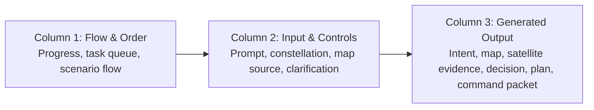

# Three-Column Layout Review / 三欄式版面專家討論

This note records the five-round discussion behind the current desktop layout. The conclusions are intentionally kept in documentation, not in the operator UI.

## Proposed Intent / 使用者提出的方向

Desktop view should become a clear three-column workflow:

1. Flowchart and sequence explanation.
2. Input fields, input guidance, and applicable buttons.
3. Generated outputs after the input action, such as intent interpretation and command results.

## Five-Round Expert Discussion / 五輪專家討論

| Round | UX Expert | Business Model Expert | Satellite Operations Engineer | Resulting UI Decision |
| --- | --- | --- | --- | --- |
| 1 | The idea is sound because each column has a clear mental model. | A three-column story is easier to demo to judges and customers. | Separation helps distinguish planning guidance from command output. | Use three persistent desktop columns: Flow & Order, Input & Controls, Generated Output. |
| 2 | The flow column should not compete with outputs. It should act like a script. | The demo should show repeatability of the workflow, not just one result. | Operators need to know the current gate before issuing commands. | Move progress, task queue, and scenario flows into the first column. |
| 3 | Input needs local guidance near the field, not only global instructions. | Input guidance helps non-technical buyers understand how they would use it. | Input guidance should include target, payload, cadence, and constraints. | Add short helper text under mission prompt, constellation setup, map source, and clarification. |
| 4 | Output should be visibly downstream of the Analyze button. | Generated output should feel like product value created by the system. | Output must show intent, area, evidence, decision, plan, approval, and command packet in order. | Move mission abstraction, map, constellation evidence, planning criteria, decision, plan, and command packet into the output column. |
| 5 | Supporting expert notes should stay out of the UI. | Business rationale can be documented but should not clutter the live demo. | Engineering test notes are not operator information. | Keep review notes in docs only; remove Product Value, Expert Iterations, and Novice Tests from UI. |

## Final Desktop Layout / 最終電腦版版面

## Why This Is Feasible / 可行性判斷

The design is feasible because it matches how an operator reasons during a mission planning session:

- First understand the workflow and current gate.
- Then enter or clarify mission inputs.
- Then inspect system-generated evidence before approving commands.

This also keeps LLM output bounded: the model may help interpret intent, but command generation remains visible, ordered, and gated by operator approval.
