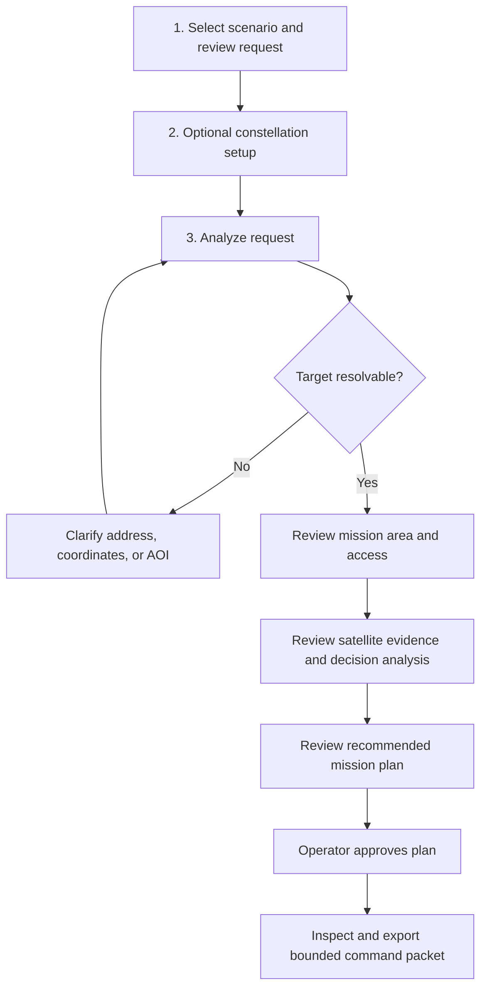

# Workflow Usability Review / 操作流程可用性檢討

This review focuses on visual separation between operation phases and the clarity of task ordering.

## Second Five-Round Expert Discussion / 第二輪五輪專家討論

| Round | UX Expert | Business Model Expert | Satellite Operations Engineer | Applied Change |
| --- | --- | --- | --- | --- |
| 1 | The screen has many useful panels, but the operator does not know where to start. | A buyer needs to see a repeatable workflow, not just a dashboard. | Operations need explicit handoffs between intent, planning, and command release. | Added the Operator Task Queue above the workspace. |
| 2 | Each panel needs a stronger phase identity. | Phase labels make the product easier to explain as a platform workflow. | Phases should separate planning evidence from command authority. | Added numbered phase labels and colored phase borders to panels. |
| 3 | The construction blocked state looks too much like an empty result. | A blocked state is valuable because it proves the product avoids bad orders. | No commands should be generated before geolocation succeeds. | Made unresolved construction requests show an explicit blocked workflow. |
| 4 | Approval and export need to feel like separate steps. | Operators and enterprise buyers care about audit gates. | Command packet release must follow operator approval. | The task queue now separates Approve, Inspect Packet, and Export. |
| 5 | Supporting content should not interrupt the operating path. | Business value should support the sale but stay out of the critical path. | Review notes and commercial story are not satellite commands. | Expert notes, business value, and scenario diagrams stay in supporting panels. |

## Novice Engineer Walkthroughs / 新手工程師三次完整流程測試

### Test 1: Wildfire From Blank Screen / 森林大火空白流程

Reaction: The engineer found the Analyze button, but after results appeared, they did not know whether to read the right rail, map, or satellite cards first.

Applied change: Added ordered task queue and numbered phase labels so attention moves from request to evidence to plan to approval.

### Test 2: Construction With Vague Target / 模糊工地位置

Reaction: The engineer thought the system failed because no satellite plan appeared after analysis.

Applied change: Reframed this as a visible blocked state: clarify target before access analysis, satellite scoring, approval, or command export.

### Test 3: Approval And Export / 批准與匯出

Reaction: The engineer could find the approval button, but was unsure what approval unlocked.

Applied change: Approval and export are now explicit task states. The command packet remains visually separated as the final output.

## Resulting Operator Sequence / 修改後操作順序

